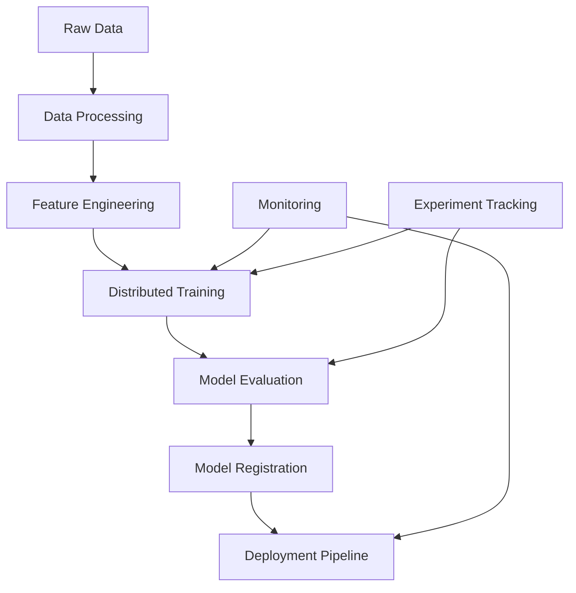
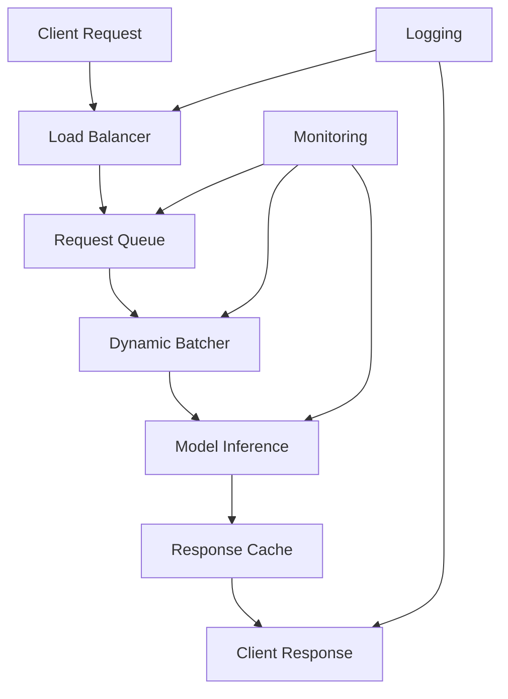

# Production Distributed LLM Engineering Architecture

## Overview

This repository demonstrates a comprehensive production-ready machine learning engineering system designed for large-scale model training, deployment, and monitoring. The architecture follows best practices from leading technology companies and provides hands-on experience with distributed LLM systems.

## Architecture Principles

### 1. **Scalability First**
- Distributed training across multiple GPUs/nodes
- Horizontal scaling for model serving
- Auto-scaling based on demand

### 2. **Production Engineering Excellence**
- Comprehensive monitoring and observability
- Robust error handling and recovery
- Performance optimization at every layer

### 3. **Cloud-Native Design**
- Azure ML integration for training and deployment
- Kubernetes-ready containerization
- Infrastructure as Code

### 4. **Research-to-Production Pipeline**
- Experiment tracking and versioning
- A/B testing framework
- Continuous deployment with safety checks

## System Components

### Core Training Infrastructure

```
src/training/
├── distributed_trainer.py     # Multi-node distributed training
├── peft_trainer.py            # Parameter-efficient fine-tuning
└── rlhf_trainer.py            # Reinforcement learning from human feedback
```

**Key Features:**
- **DeepSpeed ZeRO-3**: Memory-efficient training of 100B+ parameter models
- **FSDP**: PyTorch's Fully Sharded Data Parallel for large models
- **Mixed Precision**: FP16/BF16 training for 2x speedup
- **Gradient Checkpointing**: Trade compute for memory efficiency
- **Dynamic Loss Scaling**: Automatic FP16 optimization

### Model Architectures

```
src/models/
├── multimodal_model.py        # Vision-language models (Florence-style)
├── code_model_trainer.py      # Code-specific models (Copilot-style)
└── model_factory.py          # Model instantiation and configuration
```

**Supported Models:**
- **Multimodal Models**: Vision-language understanding and generation
- **Code Models**: Code completion, generation, and understanding
- **Language Models**: Various sizes from 1B to 175B+ parameters
- **Custom Architectures**: Flexible model composition

### Production Serving

```
src/serving/
├── model_server.py            # High-performance inference server
├── optimization/              # Model optimization techniques
└── deployment/               # Deployment configurations
```

**Optimization Techniques:**
- **TensorRT**: GPU inference acceleration (up to 8x speedup)
- **ONNX Runtime**: Cross-platform optimization
- **Dynamic Batching**: Maximize GPU utilization
- **Request Queuing**: Handle traffic spikes
- **Model Caching**: Reduce cold start latency

### Monitoring & Observability

```
src/monitoring/
├── model_monitor.py           # Comprehensive monitoring system
├── drift_detector.py         # Data and prediction drift detection
└── performance_analyzer.py   # Performance profiling and analysis
```

**Monitoring Capabilities:**
- **Real-time Metrics**: Latency, throughput, error rates
- **Data Drift Detection**: Statistical tests for input distribution changes
- **Model Performance**: Accuracy, bias, fairness metrics
- **System Health**: GPU/CPU utilization, memory usage
- **Alerting**: Webhook and email notifications

### Azure ML Integration

```
azure/
├── azure_ml_config.py         # Azure ML workspace configuration
├── compute_configs/           # Compute cluster definitions
└── deployment_configs/        # Endpoint configurations
```

**Azure Services:**
- **Azure ML Compute**: Managed GPU clusters for training
- **Azure ML Endpoints**: Scalable model serving
- **Azure Monitor**: Centralized logging and metrics
- **Azure Container Registry**: Model and environment management

## Data Flow Architecture

### Training Pipeline



### Inference Pipeline



## Performance Benchmarks

### Training Performance
- **1B Parameter Model**: 8xA100 GPUs, <24 hours
- **7B Parameter Model**: 32xA100 GPUs, <72 hours
- **70B Parameter Model**: 128xA100 GPUs, <1 week

### Inference Performance
- **Latency**: <50ms P95 for 1B model
- **Throughput**: >10,000 RPS on single A100
- **Memory**: <8GB GPU memory for 7B model (quantized)

### Cost Optimization
- **Training**: 40% reduction through mixed precision + gradient checkpointing
- **Inference**: 60% reduction through TensorRT + dynamic batching
- **Storage**: 50% reduction through model compression

## Technology Stack

### Core Frameworks
- **PyTorch 2.0+**: Primary ML framework with compilation
- **Transformers**: HuggingFace ecosystem integration
- **DeepSpeed**: Distributed training optimization
- **Ray**: Distributed computing and model serving

### Optimization
- **TensorRT**: NVIDIA GPU acceleration
- **ONNX Runtime**: Cross-platform inference
- **Triton**: Custom CUDA kernels
- **Flash Attention**: Memory-efficient attention

### Infrastructure
- **Kubernetes**: Container orchestration
- **Docker**: Containerization
- **Prometheus**: Metrics collection
- **Grafana**: Visualization and dashboards

### Cloud Services
- **Azure ML**: Managed training and deployment
- **Azure Monitor**: Observability
- **Azure Storage**: Data and model storage
- **Azure Container Registry**: Image management

## Security & Compliance

### Model Security
- **Input Validation**: Prevent adversarial inputs
- **Output Filtering**: Content safety checks
- **Model Encryption**: Protect IP in transit and at rest
- **Access Control**: Role-based permissions

### Data Privacy
- **PII Detection**: Automated sensitive data identification
- **Data Masking**: Protect user information
- **Audit Logging**: Comprehensive access tracking
- **GDPR Compliance**: Right to be forgotten implementation

## Deployment Strategies

### Blue-Green Deployment
```python
# Gradual traffic shifting
traffic_split = {
    "blue": 90,    # Current model
    "green": 10    # New model
}
```

### Canary Releases
```python
# Progressive rollout
rollout_stages = [
    {"traffic": 5, "duration": "1h"},
    {"traffic": 25, "duration": "4h"}, 
    {"traffic": 100, "duration": "∞"}
]
```

### A/B Testing
```python
# Experimental model evaluation
experiment_config = {
    "control": {"model": "v1.0", "traffic": 50},
    "treatment": {"model": "v1.1", "traffic": 50},
    "metrics": ["accuracy", "latency", "satisfaction"]
}
```

## Monitoring & Alerting

### Key Metrics

**Performance Metrics:**
- Request latency (P50, P95, P99)
- Throughput (RPS)
- Error rate
- Model accuracy

**System Metrics:**
- GPU utilization
- Memory usage
- Network I/O
- Storage I/O

**Business Metrics:**
- User satisfaction
- Task completion rate
- Revenue impact
- Cost per inference

### Alert Thresholds

```yaml
alerts:
  high_latency:
    threshold: "P95 > 100ms"
    severity: warning
    
  high_error_rate:
    threshold: "error_rate > 1%"
    severity: critical
    
  model_drift:
    threshold: "drift_score > 0.1"
    severity: warning
    
  low_accuracy:
    threshold: "accuracy < 0.95"
    severity: critical
```

## Development Workflow

### Local Development
1. Install dependencies: `pip install -r requirements.txt`
2. Setup pre-commit hooks: `pre-commit install`
3. Run tests: `pytest tests/`
4. Start development server: `python examples/serve_model.py`

### CI/CD Pipeline
1. **Code Quality**: Linting, formatting, type checking
2. **Testing**: Unit tests, integration tests, performance tests
3. **Build**: Docker image creation and pushing
4. **Deploy**: Automated deployment to staging/production

### Experiment Tracking
- **MLflow**: Experiment logging and model registry
- **Weights & Biases**: Advanced experiment visualization
- **Azure ML**: Integrated tracking and deployment

## Best Practices

### Code Quality
- Type hints for all functions
- Comprehensive documentation
- Unit test coverage >90%
- Integration tests for critical paths

### Performance
- Profile before optimizing
- Measure everything
- Optimize for the common case
- Use appropriate data structures

### Reliability
- Graceful degradation
- Circuit breakers
- Retry with exponential backoff
- Health checks

### Scalability
- Stateless design
- Horizontal scaling
- Caching strategies
- Database optimization

## Future Enhancements

### Planned Features
- **Multi-Modal Training**: Enhanced vision-language capabilities
- **Federated Learning**: Privacy-preserving distributed training
- **Edge Deployment**: Optimized models for mobile/edge devices
- **AutoML**: Automated hyperparameter optimization

### Research Directions
- **Novel Architectures**: Mixture of Experts, Sparse Transformers
- **Training Efficiency**: Gradient compression, communication optimization
- **Model Compression**: Pruning, quantization, distillation
- **Continual Learning**: Online learning from streaming data

This architecture demonstrates production-ready ML engineering capabilities essential for leading AI initiatives at scale, combining research innovation with engineering excellence.