# Production Distributed LLM Engineering - Tutorial Series

## Overview

This comprehensive tutorial series covers production-ready machine learning engineering for large language models, multimodal systems, and code-specific models. Each tutorial builds upon the previous ones to create a complete understanding of ML engineering at scale.

## 🎯 Learning Path

### **Beginner Level**
Start here if you're new to large-scale ML engineering:

1. **[Distributed Training](01_distributed_training.md)** - Master multi-GPU and multi-node training
2. **[PEFT Techniques](02_peft_techniques.md)** - Learn efficient fine-tuning methods
3. **[Model Optimization](03_model_optimization.md)** - Optimize models for production

### **Intermediate Level**
Continue with production deployment and monitoring:

4. **[Production Serving](04_production_serving.md)** - High-performance model serving
5. **[Monitoring & Observability](05_monitoring_observability.md)** - Production monitoring systems
6. **[Azure ML Integration](06_azure_ml_integration.md)** - Cloud-native ML workflows

### **Advanced Level**
Dive into specialized topics:

7. **[Multimodal Systems](07_multimodal_systems.md)** - Vision-language model engineering
8. **[Code Model Engineering](08_code_models.md)** - Specialized code generation systems
9. **[A/B Testing & Experimentation](09_ab_testing.md)** - Production experimentation
10. **[MLOps & CI/CD](10_mlops_cicd.md)** - Complete MLOps pipelines

## 📚 Tutorial Structure

Each tutorial follows a consistent structure:

```
📖 Tutorial X: Title
├── 🎯 Learning Objectives (what you'll master)
├── 📋 Prerequisites (what you need to know)
├── 🧠 Theory & Concepts (understand the why)
├── 💻 Hands-on Implementation (learn by doing)
├── 🔧 Advanced Techniques (production-ready skills)
├── 🏋️ Exercises & Challenges (test your knowledge)
├── 📊 Best Practices (industry standards)
└── 🚀 Next Steps (continue your journey)
```

## 🛠️ Setup Instructions

### Environment Setup

```bash
# Clone the repository
git clone <your-repo-url>
cd distributed-llm-guide

# Create conda environment
conda create -n distributed-llm-tutorials python=3.9
conda activate distributed-llm-tutorials

# Install dependencies
pip install -r requirements.txt

# Setup development environment
make setup

# Verify installation
python -c "import torch; print(f'PyTorch: {torch.__version__}')"
python -c "import transformers; print(f'Transformers: {transformers.__version__}')"
```

### Hardware Requirements

**Minimum Requirements:**
- 16GB RAM
- GPU with 8GB VRAM (e.g., RTX 3070)
- 50GB free disk space

**Recommended Setup:**
- 32GB+ RAM
- GPU with 24GB+ VRAM (e.g., RTX 4090, A100)
- 100GB+ free disk space
- Multi-GPU setup for distributed training

**Cloud Options:**
- Azure ML with GPU compute
- Google Colab Pro+ 
- AWS SageMaker
- Lambda Labs
- RunPod

### Software Dependencies

```python
# Core ML frameworks
torch >= 2.0.0
transformers >= 4.36.0
datasets >= 2.14.0
accelerate >= 0.25.0

# Distributed training
deepspeed >= 0.12.0
fairscale >= 0.4.13

# PEFT techniques
peft >= 0.7.0
bitsandbytes >= 0.41.0

# Model optimization
onnx >= 1.15.0
onnxruntime-gpu >= 1.16.0
optimum >= 1.15.0

# Azure integration
azure-ai-ml >= 1.12.0
azureml-core >= 1.54.0

# Monitoring & observability
prometheus-client >= 0.19.0
wandb >= 0.16.0
mlflow >= 2.9.0

# Serving & deployment
fastapi >= 0.104.0
ray[serve] >= 2.8.0
triton >= 2.1.0
```

## 🎓 Learning Outcomes

By completing this tutorial series, you will:

### **Technical Skills**
- ✅ Train billion-parameter models efficiently
- ✅ Implement state-of-the-art PEFT techniques (LoRA, QLoRA, AdaLoRA)
- ✅ Optimize models for production (quantization, pruning, distillation)
- ✅ Deploy high-performance serving systems (TensorRT, ONNX, dynamic batching)
- ✅ Build comprehensive monitoring and observability systems
- ✅ Create multimodal AI systems (vision + language)
- ✅ Develop code-specific models and tools
- ✅ Implement MLOps pipelines with CI/CD

### **Engineering Excellence**
- ✅ Production-grade code with proper testing and documentation
- ✅ Scalable architectures for enterprise deployment
- ✅ Cost optimization strategies
- ✅ Security and compliance best practices
- ✅ Performance benchmarking and optimization
- ✅ Incident response and debugging skills

### **Cloud & Infrastructure**
- ✅ Azure ML for large-scale training and deployment
- ✅ Kubernetes for container orchestration
- ✅ Infrastructure as Code (IaC) with Terraform/ARM
- ✅ Monitoring with Prometheus, Grafana, and Azure Monitor
- ✅ CI/CD pipelines with GitHub Actions and Azure DevOps

## 📊 Skill Progression Map

```mermaid
graph TD
    A[Tutorial 1: Distributed Training] --> B[Tutorial 2: PEFT Techniques]
    B --> C[Tutorial 3: Model Optimization]
    C --> D[Tutorial 4: Production Serving]
    D --> E[Tutorial 5: Monitoring & Observability]
    E --> F[Tutorial 6: Azure ML Integration]
    
    F --> G[Tutorial 7: Multimodal Systems]
    F --> H[Tutorial 8: Code Models]
    F --> I[Tutorial 9: A/B Testing]
    
    G --> J[Tutorial 10: MLOps & CI/CD]
    H --> J
    I --> J
    
    J --> K[🎉 Production ML Engineering Expert]
```



## 🏆 Assessment & Certification

### Hands-on Projects

Each tutorial includes practical projects:

1. **Distributed Training Project**: Train a 7B parameter model on multi-GPU setup
2. **PEFT Project**: Fine-tune a model with <1% of original parameters
3. **Optimization Project**: Achieve 5x inference speedup with <5% quality loss
4. **Serving Project**: Deploy model handling 1000+ QPS with <100ms latency
5. **Monitoring Project**: Build comprehensive observability dashboard
6. **Azure Project**: Create end-to-end ML pipeline on Azure
7. **Multimodal Project**: Build vision-language model for specific task
8. **Code Project**: Create code completion model for specific language
9. **A/B Testing Project**: Design and execute model comparison experiment
10. **MLOps Project**: Build complete CI/CD pipeline with automated testing

### Portfolio Projects

**Capstone Project**: Build a complete production ML system that includes:
- Large-scale distributed training
- PEFT-based fine-tuning
- Production optimization and serving
- Comprehensive monitoring and alerting
- Cloud deployment with auto-scaling
- A/B testing framework
- CI/CD pipeline with automated quality gates

## 🤝 Community & Support

### Getting Help

1. **GitHub Issues**: Report bugs or ask questions
2. **Discord Community**: Real-time discussion and help
3. **Office Hours**: Weekly sessions with instructors
4. **Study Groups**: Form groups with other learners

### Contributing

1. **Improve Tutorials**: Submit PRs for clarifications or improvements
2. **Add Examples**: Contribute additional code examples or use cases
3. **Share Projects**: Showcase your implementations and learnings
4. **Create Content**: Write blog posts or create videos about your experience

## 📅 Recommended Schedule

### **Full-time Learning (2 weeks)**
```
Week 1: Tutorials 1-5 (Core ML Engineering)
Week 2: Tutorials 6-10 (Advanced & Specialized Topics)
```

### **Part-time Learning (8 weeks)**
```
Week 1-2: Tutorial 1 (Distributed Training)
Week 3: Tutorial 2 (PEFT Techniques)
Week 4: Tutorial 3 (Model Optimization)
Week 5: Tutorial 4 (Production Serving)
Week 6: Tutorial 5 (Monitoring & Observability)
Week 7: Tutorial 6 (Azure ML Integration)
Week 8: Choose from Tutorials 7-10 based on your interests
```

### **Intensive Learning (3 days)**
```
Day 1: Tutorials 1-3 (Training & Optimization)
Day 2: Tutorials 4-6 (Deployment & Cloud)
Day 3: Choose 2 from Tutorials 7-10 (Specialization)
```

## 🎯 Practical Applications

### Real-World Skills

Each tutorial builds practical expertise for production systems:

- **System Design**: Build systems to serve billion-parameter models at scale
- **Technical Understanding**: Learn trade-offs between different PEFT methods
- **Problem Solving**: Debug model serving latency issues
- **Architecture**: Design MLOps pipelines for continuous model deployment

### Portfolio Projects

Completing these tutorials gives you concrete projects to showcase:

1. **Large-Scale ML Training**: "Trained 7B parameter language model using distributed training on 32 GPUs"
2. **Model Optimization**: "Achieved 8x inference speedup through quantization and TensorRT optimization"
3. **Production Deployment**: "Built model serving system handling 10,000+ QPS with 99.9% uptime"
4. **MLOps Implementation**: "Created end-to-end MLOps pipeline with automated testing and deployment"

## 🚀 Advanced Learning Paths

After completing the tutorials, continue your learning:

### **Research Track**
- Implement latest papers (Mamba, Mixture of Experts, etc.)
- Contribute to open-source ML frameworks
- Publish your own research or improvements

### **Engineering Track**
- Build ML infrastructure at scale
- Optimize for specific hardware (TPUs, custom chips)
- Lead ML engineering teams

### **Product Track**
- Build ML-powered products
- Focus on user experience and business impact
- Combine ML with product management skills

## 📖 Additional Resources

### **Books**
- "Designing Machine Learning Systems" by Chip Huyen
- "Machine Learning Engineering" by Andriy Burkov
- "Building Machine Learning Powered Applications" by Emmanuel Ameisen

### **Papers**
- "LoRA: Low-Rank Adaptation of Large Language Models"
- "QLoRA: Efficient Finetuning of Quantized LLMs"
- "DeepSpeed: System Optimizations Enable Training Deep Learning Models with Over 100 Billion Parameters"

### **Courses**
- CS329S: Machine Learning Systems Design (Stanford)
- MLOps Specialization (Coursera)
- Full Stack Deep Learning

### **Conferences**
- MLSys (Systems for Machine Learning)
- ICML (International Conference on Machine Learning)
- NeurIPS (Neural Information Processing Systems)
- KDD (Knowledge Discovery and Data Mining)

---

**Ready to start your journey?** Begin with [Tutorial 1: Distributed Training](01_distributed_training.md) and become a production ML engineering expert! 🚀